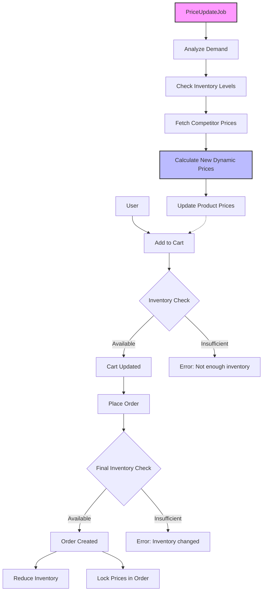

# TableCheck Ruby Take-Home

## Table of Contents

1. [Overview](#1-overview)
2. [Architecture & Key Components](#2-architecture--key-components)
   - 2.1 [Project Structure](#21-project-structure)
   - 2.2 [System Components](#22-system-components)
   - 2.3 [Dynamic Pricing Logic](#23-dynamic-pricing-logic)
   - 2.4 [Background Processing](#24-background-processing)
3. [Setup and Installation](#3-setup-and-installation)
   - 3.1 [Prerequisites](#31-prerequisites)
   - 3.2 [Installation Steps](#32-installation-steps)
4. [Running the Application](#4-running-the-application)
5. [Running Tests](#5-running-tests)
6. [API Reference](#6-api-reference)
   - 6.1 [Endpoints](#61-endpoints)
   - 6.2 [Notes](#62-notes)
7. [Example Postman Workflow](#7-example-postman-workflow)
   - 7.1 [How to Test the App Manually](#71-how-to-test-the-app-manually)
   - 7.2 [Detailed Steps](#72-detailed-steps)
8. [Troubleshooting](#8-troubleshooting)
9. [Dynamic Pricing Business Logic](#9-dynamic-pricing-business-logic)
   - 9.1 [Overview](#91-overview)
   - 9.2 [Demand-Based Adjustment](#92-demand-based-adjustment)
   - 9.3 [Inventory-Based Adjustment](#93-inventory-based-adjustment)
   - 9.4 [Competitor-Based Adjustment](#94-competitor-based-adjustment)
   - 9.5 [Price Boundaries & Automation](#95-price-boundaries--automation)
10. [Future Improvements](#10-future-improvements)

## 1. Overview

- **Project summary**: A simple e-commerce platform with a dynamic pricing engine that adjusts product prices in real-time based on demand, inventory levels, and competitor prices.
- **Tech stack**: Ruby on Rails, MongoDB, Docker, Sidekiq
- **Focus of the task**: Backend logic implementation (no UI/authentication required)

## 2. Architecture & Key Components

### 2.1 Project Structure
- `app/` — Rails application code (models, controllers, services, jobs)
  - `controllers/` — API endpoints (products, carts, orders)
  - `models/` — Data models (Product, Cart, Order, User)
  - `services/` — Business logic (DynamicPricingService, competitor API client)
  - `jobs/` — Background jobs (PriceUpdateJob for Sidekiq)
- `spec/` — RSpec test files with comprehensive coverage
- `config/` — Configuration (MongoDB, Sidekiq, routes, environments)
- `data/` — CSV inventory file and MongoDB data
- `lib/tasks/` — Rake tasks for product import and data seeding
- `docker-compose.yml` — Multi-container setup (app, MongoDB, Sidekiq)

### 2.2 System Components
- **Products**: Core catalog with dynamic pricing (default_price, dynamic_price, inventory tracking)
- **Cart**: User shopping cart with cart items that validates inventory before adding products
- **Orders**: Purchase records that atomically reduce inventory and create order items with locked-in prices
- **Dynamic Pricing**: Multi-factor pricing engine that adjusts prices based on demand patterns, inventory levels, and competitor data

### 2.3 Dynamic Pricing Logic
The system automatically adjusts prices using a 4-step process:

1. **Demand Analysis** - Compares current vs previous week activity (purchases + carts)
2. **Inventory Adjustment** - Increases prices for low stock, decreases for high stock
3. **Competitor Matching** - Aligns with external pricing data when available
4. **Boundary Control** - Caps final price between 80%-150% of default price

_For detailed business rules, see the [Dynamic Pricing Business Logic](#9-dynamic-pricing-business-logic) below._

### 2.4 Background Processing
- **PriceUpdateJob**: Sidekiq job that periodically recalculates all product prices using demand analysis, inventory levels, and external competitor pricing API

**Flow**: User adds products to cart → Places order (inventory reduced, prices locked) → Background job analyzes demand and updates dynamic prices for future purchases



## 3. Setup and Installation

### 3.1 Prerequisites
- Ruby 3.3.5
- Bundler (`gem install bundler`)
- MongoDB
- Docker

### 3.2 Installation Steps

1. **Clone repository**

   ```bash
   git clone https://github.com/mengrui-song/tablecheck-ruby-take-home.git
   cd tablecheck-ruby-take-home
   ```

2. **Install gems**

   ```bash
   bundle install
   ```

3. **Set up environment variables**

   Copy the example environment file and configure the required settings:

   ```bash
   cp .env.example .env
   ```

   Edit the `.env` file with the appropriate values. For API keys and configuration details, please refer to the [project documentation](https://docs.google.com/document/d/1cZEvCrywW8YNzLYtFU24rheLlntJy61668qkOCasIQY/edit?usp=sharing).

## 4. Running the Application

**Start app:**

```bash
docker compose up
```

**Rails console:**

```bash
docker compose exec app rails c
```

**Rebuild image (if needed):**

```bash
docker compose build app
```

**Note:** Products are automatically imported from `data/inventory.csv` during startup. If the CSV contains different quantities or prices than those in the database, existing products will be updated accordingly.

**Manual CSV import:**

To manually import or refresh product data:

```bash
docker compose exec app rails products:import
```

**Sample `.env` configuration:**

```bash
# Competitor Pricing API Configuration
COMPETITOR_API_BASE_URL=https://sinatra-pricing-api.fly.dev
COMPETITOR_API_KEY=your_api_key_here
REDIS_URL=redis://redis:6379/0
```

## 5. Running Tests

**RSpec:**

```bash
bundle exec rspec
```

**Rake (if using MiniTest):**

```bash
bundle exec rake test
```

**Prepare test database:**

```bash
bundle exec rake db:test:prepare
```

**RuboCop (linting):**

```bash
bundle exec rubocop
```

**Seed fake order data for the past 2 weeks:**

This command will clean up all existing data, import products from `inventory.csv`, create 100 users, and generate 2 weeks of order history for dynamic pricing testing.

```bash
docker compose exec app rails db:seed_last_week
```

**Run job to update dynamic prices:**

```bash
docker compose exec app rails runner "PriceUpdateJob.new.perform"
```
## 6. API Reference

### Base URL
`http://localhost:3000`

### 6.1 Endpoints

#### 1. Products

- **List all products**: `GET /products`
- **Show specific product**: `GET /products/{id}`

#### 2. Cart Management

- **Add to cart**: `POST /cart/items`
  ```json
  {
    "product_id": "product_id",
    "quantity": 2,
    "user_id": "1"
  }
  ```
- **Update cart item**: `PATCH /cart/items/{id}`
  ```json
  {
    "quantity": 5
  }
  ```
- **Remove cart item**: `DELETE /cart/items/{id}`
- **View cart**: `GET /cart?user_id={user_id}`
- **Clear cart**: `DELETE /cart?user_id={user_id}`

#### 3. Orders

- **Place order**: `POST /orders`
  ```json
  {
    "user_id": "1"
  }
  ```
- **View orders**: `GET /orders?user_id={user_id}`
- **View specific order**: `GET /orders/{id}?user_id={user_id}`

#### 4. Dynamic Pricing

- **Trigger price update**:
  ```bash
  docker-compose exec app rails runner "PriceUpdateJob.new.perform"
  ```
- **Verify updated prices**: `GET /products/{id}` (check dynamic_price field)

### 6.2 Notes
- **Product IDs**: MongoDB ObjectIds (24-character hex strings)
- **Currency**: Japanese Yen (¥) as whole numbers
- **Authentication**: Simplified with `user_id` parameter

## 7. Example Postman Workflow

### 7.1 How to Test the App Manually

1. **Import products**: Start app (products auto-import from CSV)
2. **Add to cart**: Add products with inventory validation
3. **Place order**: Create order (reduces inventory, locks prices)
4. **Trigger price job**: Run dynamic pricing calculation
5. **Verify updates**: Check if prices changed based on demand

### 7.2 Detailed Steps

> **Note**: Replace `{product1_id}`, `{product2_id}`, and other placeholders with actual values from your product list. Use the "List All Products" endpoint to get available products and their details.

#### 1. Product Management

**List All Products**

- **Method**: GET
- **URL**: `http://localhost:3000/products`
- **Expected Response**: Array of products with id, name, category, price, quantity
- **Note**: Choose any two products from this list to use as Product1 and Product2 in the following examples

**Show Specific Product**

- **Method**: GET
- **URL**: `http://localhost:3000/products/{product1_id}`
- **Response Format**:
  ```json
  {
    "id": "product1_id",
    "name": "Product1 Name",
    "category": "Product1 Category",
    "dynamic_price": "product1_price",
    "quantity": "product1_quantity"
  }
  ```

#### 2. Cart and Order Management

**Add Product1 to Cart**

- **Method**: POST
- **URL**: `http://localhost:3000/cart/items`
- **Headers**: `Content-Type: application/json`
- **Body**:
  ```json
  {
    "product_id": "{product1_id}",
    "quantity": "{valid_quantity}"
    "user_id": "1"
  }
  ```

**Add Product2 to Cart (Excessive Quantity)**

- **Method**: POST
- **URL**: `http://localhost:3000/cart/items`
- **Headers**: `Content-Type: application/json`
- **Body**:
  ```json
  {
    "product_id": "{product2_id}",
    "quantity": "{quantity_exceeding_inventory}",
    "user_id": "1"
  }
  ```
- **Expected Message**: "Not enough inventory available"

**Add Product2 to Cart (Valid Quantity)**

- **Method**: POST
- **URL**: `http://localhost:3000/cart/items`
- **Headers**: `Content-Type: application/json`
- **Body**:
  ```json
  {
    "product_id": "{product2_id}",
    "quantity": "{valid_quantity}",
    "user_id": "1"
  }
  ```
- **Expected Response**:
  ```json
  {
    "message": "Product2 updated in cart",
    "cart": {
      "id": "cart_id",
      "items": [
        {
          "id": "cart_item1_id",
          "product": {
            "id": "product1_id",
            "name": "Product1 Name",
            "price": "product1_price"
          },
          "quantity": 30,
          "subtotal": "product1_subtotal"
        },
        {
          "id": "cart_item2_id",
          "product": {
            "id": "product2_id",
            "name": "Product2 Name",
            "price": "product2_price"
          },
          "quantity": "valid_quantity",
          "subtotal": "product2_subtotal"
        }
      ]
    },
    "total_price": "total_cart_price"
  }
  ```

**Place Order**

- **Method**: POST
- **URL**: `http://localhost:3000/orders`
- **Headers**: `Content-Type: application/json`
- **Body**:
  ```json
  {
    "user_id": "1"
  }
  ```
- **Expected Message**: "Order success"

**Verify Inventory Changes**

- **Method**: GET
- **URL**: `http://localhost:3000/products/{product1_id}`
- **Expected**: Product1 quantity should be reduced by the ordered amount
- **Method**: GET
- **URL**: `http://localhost:3000/products/{product2_id}`
- **Expected**: Product2 quantity should be reduced by the ordered amount

#### 3. Dynamic Pricing

**Trigger Price Update Job**

- **Method 1**: Execute directly via Rails runner (recommended for testing)

  ```bash
  docker-compose exec app rails runner "PriceUpdateJob.new.perform"
  ```

- **Method 2**: Queue job via Sidekiq (asynchronous)

  ```bash
  docker-compose exec app rails runner "PriceUpdateJob.perform_async"
  ```

- **Method 3**: Via Rails console
  ```bash
  docker-compose exec app rails c
  # In Rails console:
  PriceUpdateJob.new.perform
  ```

**Check Updated Prices**

- **Method**: GET
- **URL**: `http://localhost:3000/products/{product1_id}`
- **Expected**: Check if `price` field has been updated based on demand

- **Method**: GET
- **URL**: `http://localhost:3000/products/{product2_id}`
- **Expected**: Check if `price` field has been updated based on demand

### Notes

- All prices are in Japanese Yen (¥) as whole numbers
- User authentication is simplified - use `user_id` parameter
- Product IDs are MongoDB ObjectIds (24-character hex strings)
- The dynamic pricing updates based on recent order history and demand

## 8. Troubleshooting

- **Gem installation failures**: Ensure you have system dependencies
- **Version conflicts**: Check `Gemfile` for required versions
- **Database connection issues**: Verify credentials in `mongoid.yml`
- **Postman request failures**: Ensure Docker containers are running with `docker-compose ps`

## 9. Dynamic Pricing Business Logic

### 9.1 Overview
This system automatically adjusts product prices based on demand trends, inventory levels, and competitor prices, while maintaining profitability and market competitiveness.

### 9.2 Demand-Based Adjustment
- **Data Requirement**: Minimum 10 transactions per week (insufficient data = no price change)
- **Growth Calculation**: Compares current week vs previous week demand (purchases + cart additions)
- **Weighted Scoring**: Purchase growth weighted more heavily than cart additions
- **Price Tier Weighting**:
  - Low-priced items → purchases 80%, carts 20%
  - High-priced items → purchases 40%, carts 60%
  - Premium items → purchases 50%, carts 50%
- **Price Multipliers**: Strong growth = up to +50%, strong decline = up to -25%
- **Smoothing**: Limits changes to ±15% per adjustment, overall 0.7x to 1.5x original

### 9.3 Inventory-Based Adjustment
- **Low stock** (≤50 units) → +30% increase
- **High stock** (>250 units) → -10% discount
- **Category Modifiers**:
  - Footwear → +5% (higher demand)
  - Accessories → -5% (price-sensitive)
  - Clothing → neutral baseline
- **Skip Conditions**: Stable demand (multiplier = 1.0) or missing stock data

### 9.4 Competitor-Based Adjustment
- **Price too high** (>10% above competitor) → reduce to within 20% of competitor
- **Price too low** (>5% below competitor) → increase up to 5%
- **Competitive range** (±5-10%) → no change
- **Goal**: Competitive alignment without price wars

### 9.5 Price Boundaries & Automation
- **Final Bounds**: 80% to 150% of default price
- **Currency**: Whole yen (¥) values only
- **Schedule**: Weekly Sidekiq job, Mondays at 9:00 AM
- **Sequence**: Demand → Inventory → Competitor → Boundary Enforcement
- **Performance**: Bulk operations for large catalogs

## 10. Future Improvements

- Add rate limiting for competitor API requests
- Implement authentication (JWT)
- Cache price calculations for large catalogs
