# TableCheck Ruby Take-Home

## Table of Contents

1. [Overview](#1-overview)
2. [Architecture & Key Components](#2-architecture--key-components)
   - 2.1 [Project Structure](#21-project-structure)
   - 2.2 [System Components](#22-system-components)
   - 2.3 [Dynamic Pricing Logic](#23-dynamic-pricing-logic)
   - 2.4 [Background Processing](#24-background-processing)
   - 2.5 [Race Condition Prevention & Order Management](#25-race-condition-prevention--order-management)
3. [Setup and Installation](#3-setup-and-installation)
   - 3.1 [Prerequisites](#31-prerequisites)
   - 3.2 [Installation Steps](#32-installation-steps)
4. [Running the Application](#4-running-the-application)
5. [Running Tests](#5-running-tests)
6. [API Reference](#6-api-reference)
   - 6.1 [Products](#61-products)
   - 6.2 [Cart Management](#62-cart-management)
   - 6.3 [Orders](#63-orders)
7. [Example Postman Workflow](#7-example-postman-workflow)
   - 7.1 [Preparation](#71-preparation)
   - 7.2 [Product Management](#72-product-management)
   - 7.3 [Cart and Order Management](#73-cart-and-order-management)
   - 7.4 [Testing Inventory Rollback on Failed Orders](#74-testing-inventory-rollback-on-failed-orders)
   - 7.5 [Dynamic Pricing](#75-dynamic-pricing)
   - 7.6 [Testing Race Condition Prevention](#76-testing-race-condition-prevention)
can8. [Troubleshooting](#8-troubleshooting)
9. [Dynamic Pricing Business Logic](#9-dynamic-pricing-business-logic)
   - 9.1 [Overview](#91-overview)
   - 9.2 [Demand-Based Adjustment](#92-demand-based-adjustment)
   - 9.3 [Inventory-Based Adjustment](#93-inventory-based-adjustment)
   - 9.4 [Competitor-Based Adjustment](#94-competitor-based-adjustment)
   - 9.5 [Price Boundaries & Automation](#95-price-boundaries--automation)
10. [Future Improvements](#10-future-improvements)

## 1. Overview

- **Project summary**: A simple e-commerce platform with a dynamic pricing engine that adjusts product prices in real-time based on demand, inventory levels, and competitor prices.
- **Tech stack**: Ruby on Rails, MongoDB, Docker, Sidekiq
- **Focus of the task**: Backend logic implementation (no UI/authentication required)

## 2. Architecture & Key Components

### 2.1 Project Structure

- `app/` — Rails application code (models, controllers, services, jobs)
  - `controllers/` — API endpoints (products, carts, orders)
  - `models/` — Data models (Product, Cart, Order, User)
  - `services/` — Business logic (DynamicPricingService, competitor API client)
  - `jobs/` — Background jobs (PriceUpdateJob, OrderCleanupJob for Sidekiq)
- `spec/` — RSpec test files with comprehensive coverage
- `config/` — Configuration (MongoDB, Sidekiq, routes, environments)
- `data/` — CSV inventory file and MongoDB data
- `lib/tasks/` — Rake tasks for product import and data seeding
- `docker-compose.yml` — Multi-container setup (app, MongoDB, Sidekiq)

### 2.2 System Components

- **Products**: Core catalog with dynamic pricing (default_price, dynamic_price, inventory tracking)
- **Cart**: User shopping cart with cart items that validates inventory before adding products
- **Orders**: Purchase records that atomically reduce inventory and create order items with locked-in prices
  - **Race Condition Prevention**: Uses MongoDB atomic operations (`find_one_and_update`) to prevent overselling
  - **Order Status Management**: Four distinct statuses for clear order tracking
    - `pending`: Order placed successfully, awaiting completion
    - `paid`: Order completed successfully
    - `failed`: Order failed due to insufficient inventory (no inventory impact)
    - `expired`: Order was pending too long and timed out (inventory restored)
  - **Automatic Cleanup**: `OrderCleanupJob` runs every minute to handle expired orders and restore inventory
- **Dynamic Pricing**: Multi-factor pricing engine that adjusts prices based on demand patterns, inventory levels, and competitor data

### 2.3 Dynamic Pricing Logic

The system automatically adjusts prices using a 4-step process:

1. **Demand Analysis** - Compares current vs previous week activity (purchases + carts)
2. **Inventory Adjustment** - Increases prices for low stock, decreases for high stock
3. **Competitor Matching** - Aligns with external pricing data when available
4. **Boundary Control** - Caps final price between 80%-150% of default price

_For detailed business rules, see the [Dynamic Pricing Business Logic](#9-dynamic-pricing-business-logic) below._

### 2.4 Background Processing

- **PriceUpdateJob**: Sidekiq job that runs weekly (every Monday at 9:00 AM) to recalculate all product prices using demand analysis, inventory levels, and external competitor pricing API
- **OrderCleanupJob**: Sidekiq job that runs every minute to clean up expired orders
  - Finds orders with status `pending` and `expires_at` < current time
  - Restores inventory for expired orders (returns reserved stock to available pool)
  - Marks expired orders as `expired` status
  - Does NOT affect `failed` orders (they never reduced inventory)

**Flow**: User adds products to cart → Places order (atomic inventory locking + 15min expiration) → Background job analyzes demand and updates dynamic prices for future purchases

### 2.5 Race Condition Prevention & Order Management

#### Atomic Inventory Operations

- **Problem**: Multiple users trying to purchase the last item simultaneously could cause overselling
- **Solution**: MongoDB's `find_one_and_update` with conditional filters ensures only one transaction succeeds
- **Implementation**: Inventory check and decrement happen atomically in a single database operation

#### Inventory Rollback Protection

- **Problem**: Partial order failure could leave some items with reduced inventory while others fail
- **Solution**: Track processed items and rollback all inventory changes if any item fails
- **Implementation**: Failed orders restore all previously decremented inventory and save order as "failed" status

#### Order Expiration System

- **15-Minute Window**: Orders expire 15 minutes after placement if not completed
- **Automatic Cleanup**: `OrderCleanupJob` runs every minute to:
  - Identify expired pending orders
  - Return reserved inventory to available stock
  - Mark orders as "expired" status
- **Prevents Stock Lockup**: Ensures inventory doesn't remain locked indefinitely

```mermaid
graph TD
    A[User Places Order] --> B[Status: PENDING<br/>⏰ expires_at = 15min]

    B --> C{Process Cart Items<br/>One by One}

    C --> D{Item 1: Atomic Check<br/>find_one_and_update}

    D -->|❌ Insufficient Stock| E[Status: FAILED<br/>💾 No Inventory Change<br/>🚫 Raise Exception]

    D -->|✅ Stock Available| F[📦 Item 1 Inventory Reduced<br/>📝 Track for Rollback]

    F --> G{Item 2: Atomic Check<br/>find_one_and_update}

    G -->|❌ Insufficient Stock| H[↩️ Rollback Item 1 Inventory<br/>Status: FAILED<br/>🚫 Raise Exception]

    G -->|✅ Stock Available| I[📦 All Items Processed<br/>📝 Create Order Items]

    I --> J[Status: PAID<br/>✅ Order Complete<br/>⏰ expires_at = nil]

    B -->|⏰ 15min Timeout<br/>No Payment| K[OrderCleanupJob<br/>Runs Every Minute]

    K --> L[Status: EXPIRED<br/>↩️ Restore Inventory]

    %% Styling
    style J fill:#90EE90,stroke:#333,stroke-width:2px
    style E fill:#FFB6C1,stroke:#333,stroke-width:2px
    style H fill:#FFB6C1,stroke:#333,stroke-width:2px
    style L fill:#FFA500,stroke:#333,stroke-width:2px
    style B fill:#FFFF99,stroke:#333,stroke-width:2px
    style K fill:#87CEEB,stroke:#333,stroke-width:2px
```



## 3. Setup and Installation

### 3.1 Prerequisites

- Ruby 3.3.5
- Bundler (`gem install bundler`)
- MongoDB
- Docker

### 3.2 Installation Steps

- **Clone repository**

  ```bash
  git clone https://github.com/mengrui-song/tablecheck-ruby-take-home.git
  cd tablecheck-ruby-take-home
  ```

- **Install gems**

  This is for running test not on docker

  ```bash
  bundle install
  ```

- **Set up environment variables**

  Copy the example environment file and configure the required settings:

  ```bash
  cp .env.example .env
  ```

  Edit the `.env` file with the appropriate values. For API keys and configuration details, please refer to the [project documentation](https://docs.google.com/document/d/1cZEvCrywW8YNzLYtFU24rheLlntJy61668qkOCasIQY/edit?usp=sharing).

**Seed fake order data for the past 2 weeks (optional — creates test orders & users)**

This command will clean up all existing data, import products from `inventory.csv`, create 100 users, and generate 2 weeks of order history for dynamic pricing testing.

```bash
docker compose exec app rails db:seed_last_week
```

## 4. Running the Application

**Start app:**

```bash
docker compose up
```

**Rails console:**

```bash
docker compose exec app rails c
```

**Rebuild image (if needed):**

```bash
docker compose build app
```

**Note:** Products are automatically imported from `data/inventory.csv` during startup. If the CSV contains different quantities or prices than those in the database, existing products will be updated accordingly.

**Manual CSV import:**

To manually import or refresh product data:

```bash
docker compose exec app rails products:import
```

**Run job to update dynamic prices (manual trigger)**

You can trigger the weekly price-update job manually if you want to test the dynamic pricing logic immediately:

```bash
docker compose exec app rails runner "PriceUpdateJob.new.perform"
```

**Run job to clean up orders expired(manual trigger)**

You can trigger the order clean up job manually if you want to test it immediately:

```bash
docker compose exec app rails runner "OrderCleanupJob.new.perform"
```

## 5. Running Tests

**All tests:**

```bash
bundle exec rspec
```

**RuboCop (linting):**

```bash
bundle exec rubocop
```

## 6. API Reference

### Base URL

`http://localhost:3000`

### 6.1. Products

- **List all products**: `GET /products`
- **Show specific product**: `GET /products/{id}`

### 6.2. Cart Management

- **Add to cart**: `POST /cart/items`
  ```json
  {
    "product_id": "{product_id}",
    "quantity": 2,
    "user_id": "{user_id}"
  }
  ```
- **Update cart item**: `PATCH /cart/items/{id}`
  ```json
  {
    "quantity": 5,
    "user_id": "{user_id}"
  }
  ```
- **Remove cart item**: `DELETE /cart/items/{id}`
  ```json
  {
    "user_id": "{user_id}"
  }
  ```
- **View cart**: `GET /cart?user_id={user_id}`
- **Clear cart**: `DELETE /cart?user_id={user_id}`

### 6.3. Orders

- **Place order**: `POST /orders`
  ```json
  {
    "user_id": "{user_id}"
  }
  ```
- **View orders**: `GET /orders?user_id={user_id}`
- **View specific order**: `GET /orders/{id}?user_id={user_id}`

## 7. Example Postman Test Workflow

### 7.1 Preparation

1. **Import products**: Start app (products auto-import from CSV)
```bash
docker compose up
```
2. **Create a user**
```bash
docker compose run app rails c
```

```ruby
# create  a test user
User.create(email: "tablecheck.gmail.com", name: "tablecheck")

# check the user_id
user_id
```

3. **Prepare 2 products**

```ruby
product1 = Product.first
product2 = Product.second
```
### 7.2 Product Management

**1. List All Products**

- **Method**: GET
- **URL**: `http://localhost:3000/products`
- **Expected Response**: Array of products with id, name, category, price, quantity

**2. Show Specific Product**

- **Method**: GET
- **URL**: `http://localhost:3000/products/{product1_id}`
- **Response Format**:
  ```json
  {
    "id": "product1_id",
    "name": "Product1 Name",
    "category": "Product1 Category",
    "dynamic_price": "product1_price",
    "quantity": "product1_quantity"
  }
  ```

### 7.3 Cart and Order Management

**1. Add Product1 to Cart**

- **Method**: POST
- **URL**: `http://localhost:3000/cart/items`
- **Headers**: `Content-Type: application/json`
- **Body**:
  ```json
  {
    "product_id": "{product1_id}",
    "quantity": "{valid_quantity}",
    "user_id": "{user_id}"
  }
  ```

**2. Add Product2 to Cart with Excessive Quantity**

- **Method**: POST
- **URL**: `http://localhost:3000/cart/items`
- **Headers**: `Content-Type: application/json`
- **Body**:
  ```json
  {
    "product_id": "{product2_id}",
    "quantity": "{quantity_exceeding_inventory}",
    "user_id": "user_id"
  }
  ```
- **Expected Message**: "Not enough inventory available for {product_name}"

**3. Add Product2 to Cart with Valid Quantity**

- **Method**: POST
- **URL**: `http://localhost:3000/cart/items`
- **Headers**: `Content-Type: application/json`
- **Body**:
  ```json
  {
    "product_id": "{product2_id}",
    "quantity": "{valid_quantity}",
    "user_id": "user_id"
  }
  ```
- **Expected Response**:
  ```json
  {
    "message": "Product2 updated in cart",
    "cart": {
      "id": "cart_id",
      "items": [
        {
          "id": "cart_item1_id",
          "product": {
            "id": "product1_id",
            "name": "Product1 Name",
            "price": "product1_price"
          },
          "quantity": "valid_quantity",
          "subtotal": "product1_subtotal"
        },
        {
          "id": "cart_item2_id",
          "product": {
            "id": "product2_id",
            "name": "Product2 Name",
            "price": "product2_price"
          },
          "quantity": "valid_quantity",
          "subtotal": "product2_subtotal"
        }
      ]
    },
    "total_price": "total_cart_price"
  }
  ```

**4. Place Order**

- **Method**: POST
- **URL**: `http://localhost:3000/orders`
- **Headers**: `Content-Type: application/json`
- **Body**:
  ```json
  {
    "user_id": "user_id"
  }
  ```
- **Expected Message**: "Order placed successfully"

**Verify Inventory Changes**

- **Method**: GET
- **URL**: `http://localhost:3000/products/{product1_id}`
- **Expected**: Product1 quantity should be reduced by the ordered amount
- **Method**: GET
- **URL**: `http://localhost:3000/products/{product2_id}`
- **Expected**: Product2 quantity should be reduced by the ordered amount

### 7.4 Testing Inventory Rollback on Failed Orders

**Scenario**: Test that inventory is properly rolled back when an order fails due to insufficient stock

**1. Prepare Test Data**

```bash
docker compose run app rails c
```

```ruby
# Create a test user
user = User.create!(email: "rollback_test@example.com", name: "Rollback Test User")

# Set up products with specific quantities
product1 = Product.first
product2 = Product.second
product1.update!(quantity: 10)  # Sufficient inventory
product2.update!(quantity: 5)   # Limited inventory

puts "Initial inventory - Product1: #{product1.quantity}, Product2: #{product2.quantity}"
```

**2. Add Items to Cart Successfully**

- **Method**: POST
- **URL**: `http://localhost:3000/cart/items`
- **Body**:
  ```json
  {
    "product_id": "{product1_id}",
    "quantity": 8,
    "user_id": "{user_id}"
  }
  ```

- **Method**: POST
- **URL**: `http://localhost:3000/cart/items`
- **Body**:
  ```json
  {
    "product_id": "{product2_id}",
    "quantity": 5,
    "user_id": "{user_id}"
  }
  ```

**3. Simulate Inventory Reduction**

```ruby
# Reduce product2 inventory to less than cart quantity
product2.update!(quantity: 3)  # Cart has 5 but only 3 available
puts "Updated inventory - Product1: #{product1.reload.quantity}, Product2: #{product2.reload.quantity}"
```

**4. Attempt Order Placement**

- **Method**: POST
- **URL**: `http://localhost:3000/orders`
- **Body**:
  ```json
  {
    "user_id": "{user_id}"
  }
  ```

**5. Expected Results**

- ❌ **Order fails** with error: "Not enough inventory for Product2. Available: 3, Requested: 5"
- ✅ **Product1 inventory unchanged**: Still 10 (rollback successful)
- ✅ **Product2 inventory unchanged**: Still 3 (no deduction on failed order)
- ✅ **Cart items preserved**: User can modify cart and retry
- 📝 **Failed order saved**: User has 1 order with status "failed" in order history

**6. Verification**

```ruby
# Check inventory - should be unchanged
product1.reload.quantity  # Expected: 10
product2.reload.quantity  # Expected: 3

# Check user's order history
user.orders.where(status: "failed").count  # Expected: 1
failed_order = user.orders.where(status: "failed").first
puts "Failed order status: #{failed_order.status}"

# Check cart still has items
user.cart.cart_items.count  # Expected: 2
```

This test demonstrates the atomic order processing with proper inventory rollback, ensuring no partial inventory changes occur when orders fail.

### 7.5. Dynamic Pricing

**1. Run Seed to Create Order Histories**

Note: The dynamic pricing logic requires order history to calcualte the demand, so make sure seed the order histories bedore check the price update job.

```bash
docker compose exec app rails db:seed_last_week
```


**2. Trigger Price Update Job**

You can check the prices are updated by running the following job.
  ```bash
  docker-compose exec app rails runner "PriceUpdateJob.new.perform"
  ```


### 7.6 Testing Race Condition Prevention

**Scenario**: Test concurrent purchase attempts on limited inventory

**1. Prepare user and product for test**:

   ```bash
   docker compose run app rails c
   ```
   ```ruby
   product1.update(quantity: 1)
   usera = User.create(email: "usera@example.com", name: "usera")
   userb = User.create(email: "userb@example.com", name: "userb")
   ```

**2. Add product to two different users' carts simultaneously**:

   ```bash
   // User A cart
   POST /cart/items
   {
     "user_id": "user_a_id",
     "product_id": "{product1_id}",
     "quantity": 1
   }

   // User B cart
   POST /cart/items
   {
     "user_id": "user_b_id",
     "product_id": "{product1_id}",
     "quantity": 1
   }
   ```

**3. Place orders quickly** (both should work at cart level):
```bash
curl -X POST http://localhost:3000/orders -H "Content-Type: application/json" -d '{"user_id":"user_a_id"}' &
curl -X POST http://localhost:3000/orders -H "Content-Type: application/json" -d '{"user_id":"user_b_id"}' &
wait
 ```
```bash
curl -X POST http://localhost:3000/orders -H "Content-Type: application/json" -d '{"user_id":"69022a2820b633ca4f4eb1bb"}' &
curl -X POST http://localhost:3000/orders -H "Content-Type: application/json" -d '{"user_id":"69022a2820b633ca4f4eb1bc"}' &
wait
 ```

**4. Expected Results**:

   - ✅ User A: Order succeeds (status: "paid")
   - ❌ User B: Order fails with "Not enough inventory" error
   - 🔍 Product quantity becomes 0 (not negative)

   ```bash
   docker compose run app rails c
   ```
   ```ruby
   usera.orders
   ### [#<Order _id: 69022c260379c68974f1eae9, created_at: 2025-10-29 15:00:54.355 UTC, updated_at: 2025-10-29 15:00:54.417 UTC, user_id: BSON::ObjectId('69022a2820b633ca4f4eb1bb'), status: "paid", total_price: 2404, expires_at: nil>]
   userb.orders
   ### userb.orders[#<Order _id: 69022c260379c68974f1eae8, created_at: 2025-10-29 15:00:54.352 UTC, updated_at: 2025-10-29 15:00:54.352 UTC, user_id: BSON::ObjectId('69022a2820b633ca4f4eb1bc'), status: "pending", total_price: 0, expires_at: 2025-10-29 15:15:54.351 UTC>]
   product1.reload.quantity
   ### 0
   ```
  After 15 minutes from placing the order,
  run `docker compose exec app rails runner "OrderCleanupJob.new.perform" ` to clean up the orders.

  Check the order is expired.
  ```bash
  reload!
  userb.orders
  ```
**4. Run**:

### Notes

- All prices are in Japanese Yen (¥) as whole numbers
- User authentication is simplified - use `user_id` parameter
- Product IDs are MongoDB ObjectIds (24-character hex strings)
- The dynamic pricing updates based on recent order history and demand

## 8. Troubleshooting

- **Gem installation failures**: Ensure you have system dependencies
- **Version conflicts**: Check `Gemfile` for required versions
- **Database connection issues**: Verify credentials in `mongoid.yml`
- **Postman request failures**: Ensure Docker containers are running with `docker-compose ps`

## 9. Dynamic Pricing Business Logic Explaination

### 9.1 Overview

This system automatically adjusts product prices based on demand trends, inventory levels, and competitor prices, while maintaining profitability and market competitiveness.

### 9.2 Demand-Based Adjustment

- **Data Requirement**: Minimum 10 transactions per week (insufficient data = no price change)
- **Growth Calculation**: Compares current week vs previous week demand (purchases + cart additions)
- **Weighted Scoring**: Purchase growth weighted more heavily than cart additions
- **Price Tier Weighting**:
  - Low-priced items → purchases 80%, carts 20%
  - High-priced items → purchases 40%, carts 60%
  - Premium items → purchases 50%, carts 50%
- **Price Multipliers**: Strong growth = up to +50%, strong decline = up to -25%
- **Smoothing**: Limits changes to ±15% per adjustment, overall 0.7x to 1.5x original

### 9.3 Inventory-Based Adjustment

- **Low stock** (≤50 units) → +30% increase
- **High stock** (>250 units) → -10% discount
- **Category Modifiers**:
  - Footwear → +5% (higher demand)
  - Accessories → -5% (price-sensitive)
  - Clothing → neutral baseline
- **Skip Conditions**: Stable demand (multiplier = 1.0) or missing stock data

### 9.4 Competitor-Based Adjustment

- **Price too high** (>10% above competitor) → reduce to within 20% of competitor
- **Price too low** (>5% below competitor) → increase up to 5%
- **Competitive range** (±5-10%) → no change
- **Goal**: Competitive alignment without price wars

### 9.5 Price Boundaries & Automation

- **Final Bounds**: 80% to 150% of default price
- **Currency**: Whole yen (¥) values only
- **Schedule**: Weekly Sidekiq job, Mondays at 9:00 AM
- **Sequence**: Demand → Inventory → Competitor → Boundary Enforcement
- **Performance**: Bulk operations for large catalogs

## 10. Future Improvements

### Security Enhancements
- **Authentication**: Implement JWT-based user authentication system with proper user roles and permissions
- **API Protection**: Add rate limiting and request throttling to prevent abuse
- **Data Security**: Enhance encryption for sensitive information (API keys, user data)

### Performance Optimizations
- **Database Indexing**: Add strategic MongoDB indexes for critical queries (order analysis, inventory checks, product lookups)
- **Background Job Optimization**: Reduce API calls in PriceUpdateJob, implement bulk operations, and add performance monitoring
- **Query Optimization**: Use MongoDB aggregation pipelines for complex demand analysis queries to reduce database load
- **Selective Caching**: Cache external API responses (competitor pricing) and expensive calculations when beneficial

### Error Handling & Monitoring
- **Custom Exceptions**: Replace generic `raise` statements with custom exception classes for better error categorization
- **API Standardization**: Implement standardized error response formats across all endpoints
- **Observability**: Add comprehensive logging, metrics, and alerting for production monitoring
